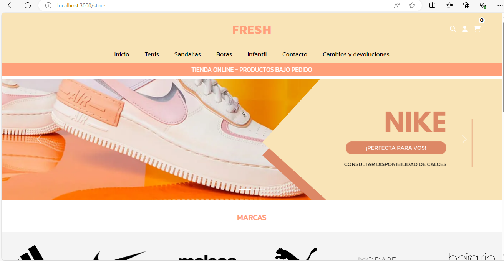
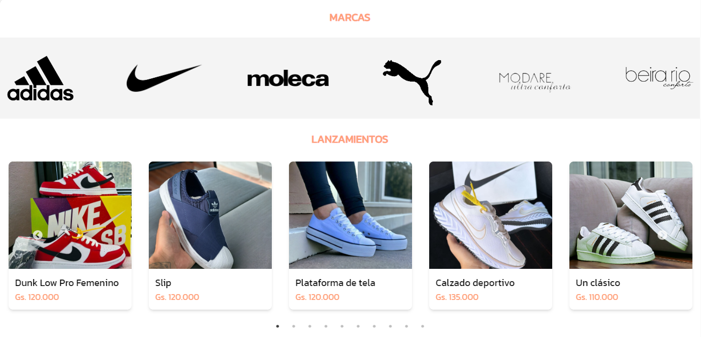
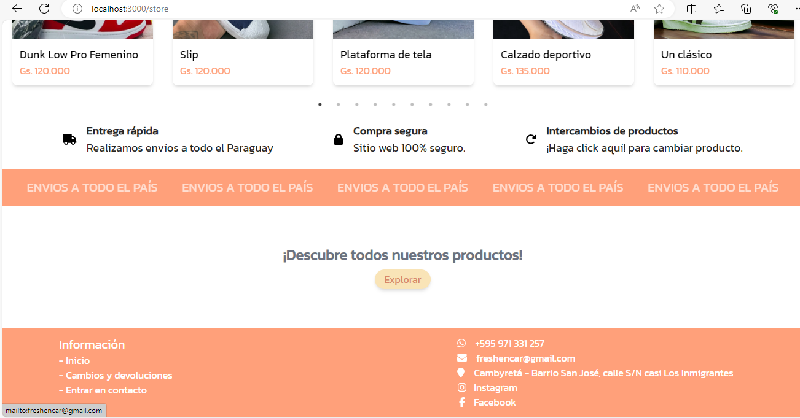

# Ecommerce con Next.js, Node.js, MongoDB, React, Express.js, Tailwind
## Descripción
 El E-commerce está diseñado para una tienda de calzados y cuenta con diversas funcionalidades para ofrecer una experiencia de compra óptima a los usuarios.

## Características Principales

- Catálogo de productos con filtrado por categoría para facilitar la navegación.
- Sistema de registro de usuarios y autenticación de login para una experiencia personalizada.
- Detalles del producto con imágenes, descripción y precios.
- Carrito de compras  para seleccionar y gestionar productos antes de la compra.

## Tecnologías Utilizadas

- **Frontend:** React.js, HTML, CSS (Tailwind CSS)
- **Backend:** Node.js, Express
- **Base de Datos:** MongoDB
- **Otros:** JavaScript, Git, Nodemailer

## Capturas de Pantalla

